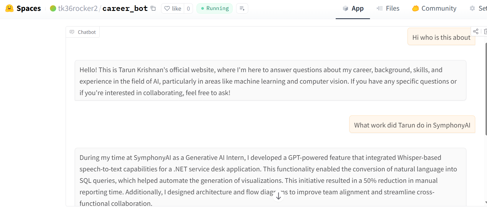

# Agentic Career Bot

Career Bot is an agentic AI powered personal career assistant that represents an individual professionally through conversation. 

The system is agentic by design, meaning it not only generates text responses but can also invoke **tools** when specific intents are detected. These intents include cases where a user wants to reach out or when the model cannot confidently answer a question. In such situations, Career Bot triggers real time SMS style push notifications via **Pushover**, notifying the owner of user interest or unanswered queries.

### Sample Conversation

Below is an example interaction with Career Bot, demonstrating how it answers career related questions and maintains a professional tone suitable for recruiters and hiring managers.

    <em>Example conversation showing Career Bot acting as a professional career assistant</em> 

### Deployment
Career Bot is deployed using **Gradio** on **Hugging Face Spaces**.
The repository can be pushed directly to Hugging Face, with environment variables configured in the Space **Secrets** settings.

